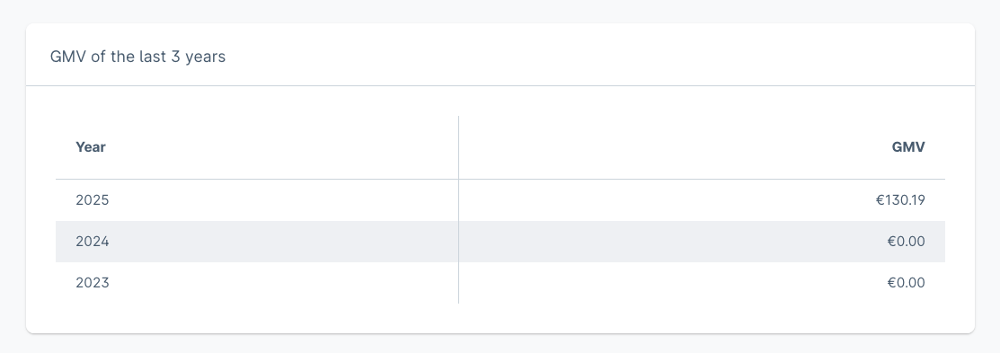
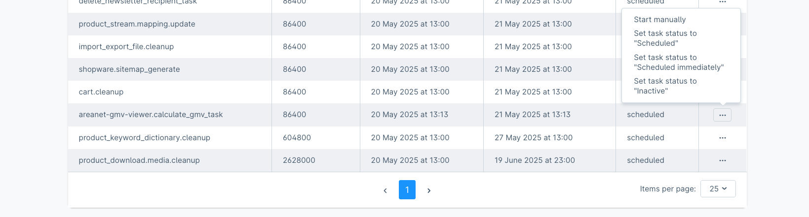

# Shopware 6 Plugin: GMV Viewer

Shopware 6 Plugin, um den GMV der letzten 3 Jahre im Dashboard anzuzeigen. Der GMV wird lokal auf dem eigenen Server
berechnet, ohne jegliche Übertragung der Bestelldate an externe Anbieter. Die Berechnung erfolgt auf den Vorgaben von 
Shopware:

- Berechnung mit Nettowerten
- Versandkosten sind inkludiert
- Retouren oder Stornierungen reduzieren den GMV nicht

**Achtung: Nutzung des Plugin und des ermittelten GMV ohne Gewähr.**

Shopware 6 plugin to display the GMV of the last 3 years in the dashboard. The GMV is calculated locally on your own server
, without any transfer of order data to external providers. The calculation is based on the specifications of
Shopware:

- Calculation with net values
- Shipping costs are included
- Returns or cancelations do not reduce the GMV

**Attention: Use of the plugin and the calculated GMV without guarantee.**

## Hnweise / Notes

Die Berechnung erfolgt per Scheduled Task einmal am Tag für die letzten drei Jahre. Vergangene Jahre werden nicht erneut
berechnet. Über die Frosh Tools kann die Aufgabe zu Beginn auch manuell gestartet werden.

The calculation is performed once a day for the last three years using a scheduled task. Past years are not recalculated
. The task can also be started manually at the beginning using the Frosh tools.

## Unterstützte Shopware Versionen und Changelog

Stand 20.05.2025:
- **6.6.0 - 6.6.10.4**
- [CHANGELOG](CHANGELOG.md)
- [Download](https://github.com/AREA-NET-GmbH-Shopware-Agentur/shopware6-plugin-gmv-viewer/releases)

## Installation

### ZIP-Release

Download des entsprechenden ZIP-Files von der [Release-Seite](https://github.com/AREA-NET-GmbH-Shopware-Agentur/shopware6-plugin-gmv-viewer/releases) und Installation/Upload in der Shopware-Administration unter Erweiterungen.

### Composer

`composer require areanet/gmv-viewer`

## Support

Wir bieten zu unseren Open-Source-Plugins kostenpflichtigen Support an

* [Online-Formular](https://www.area-net.de/kontakt)
* [shopware@area-net.de](mailto:shopware@area-net.de)

## Shopware Theme und Plugins

Neben kostenlosen Open-Source Shopware-Plugins bietet die Shopware-Agentur auch Themes und Plugins im Shopware-Store an:

- [aloha Theme](https://store.shopware.com/en/arean62788672693m/a-better-cms-theme-optimized-checkout-b2b-functions-flexibly-customizable.html) mit optimiertem Checkout
- [aloha CMS Elements](https://store.shopware.com/arean13931131788m/a-better-cms-elements-slider-bilder-html5-video-google-maps-vorher-nachher-bilder.html) mit umfangreichen Erweiterungen der Standard-Inhaltselemente
- [Pagespeed Booster](https://store.shopware.com/arean41766445685m/pagespeed-booster-paypal-und-externe-skripte-auf-der-startseite-deaktivieren.html) deaktiviert PayPal und Co. auf der Startseite
- [Optimierte Inhaltsbearbeitung](https://store.shopware.com/arean36129443353f/optimierte-inhaltsbearbeitung-inhalte-nur-im-designer-bearbeiten-inhalte-in-layout-uebertragen.html) für CMS-Seiten und Kategorien
- [HTTP-Auth](https://store.shopware.com/arean97586892435f/http-authentifizierung-fuer-verkaufskanaele.html) für Verkaufskanäle

## AREA-NET GmbH
Die AREA-NET GmbH ist Shopware Partner Agentur und Shopware Hersteller, sowie Pickware Partner aus dem Großraum Stuttgart in Baden-Württemberg/Deutschland.

**Adresse**\
Öschstrasse 33\
73072 Donzdorf

Telefon: +49 (0)7162 - 941140\
Mail: [shopware@area-net.de](mailto:shopware@area-net.de)\
Web: [www.area-net.de](https://www.area-net)

Mehr Informationen, Projektanfragen und Support gibt es auf der Website der [Shopware-Agentur AREA-NET GmbH](https://www.area-net.de).

**Follow us**

- https://linkedin.com/companyarea-net-gmbh-shopware-agentur
- https://www.facebook.com/area.net.gmbh

